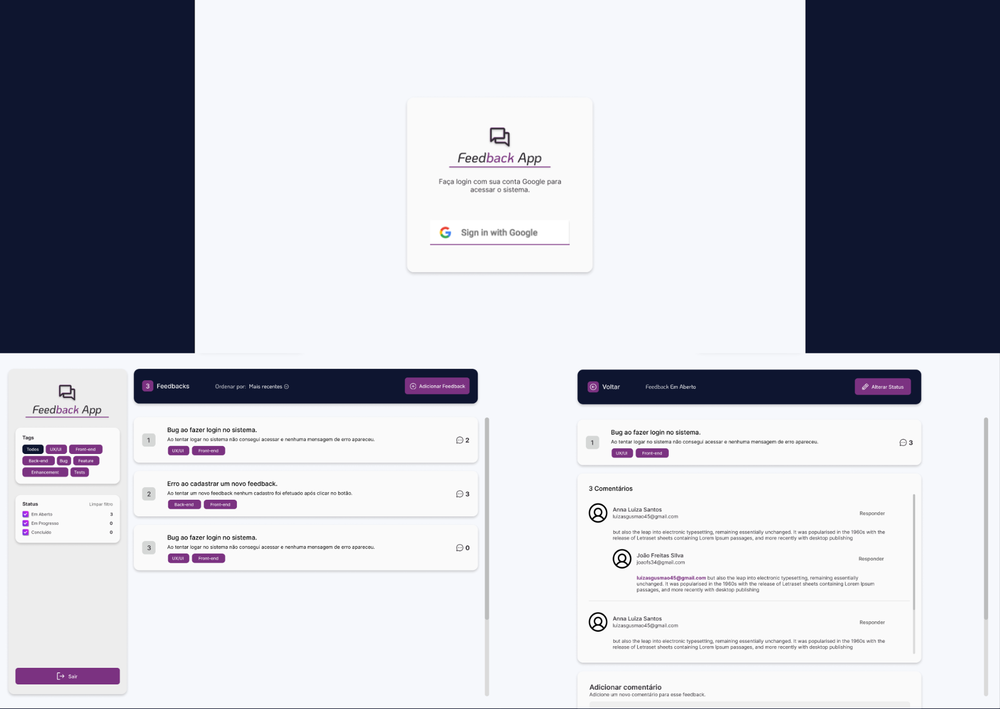

<p align="center">
  
</p>

## 🎉 Let's go!

Para iniciar o projeto insira o comando:
```
npm run dev
```
ou entre no link:
```

```


## 🎥 Demonstração 


## 💻 Projeto

Uma aplicação simples cuja principal funcionalidade é adicionar feedbacks e comentários a respeito de um determinado produto que uma empresa ofereça. Assim, os usuários poderão efetuar login com suas contas Google autenticadas pelo Firebase e realizar os feedbacks necessários sendo identificados por seus e-mails.
<br>
A aplicação também fornece tags e filtros, permitindo aos usuários identificar os feedbacks e filtrá-los da melhor maneira caso desejem realizar uma análise mais detalhada. Ademais, todos os usuários possuem o <b>mesmo nível</b> de acesso, podendo realizar as mesmas funções no software.


## 🚀 Tecnologias

Esse projeto foi desenvolvido com as seguintes tecnologias:

- HTML e CSS
- Typescript
- React
- Node e NPM
- Vite
- Firebase


## 📚 Bibliotecas

- Phosphor Icons
- Styled Components
- React Router
- React Select
- MUI

## 🎨 Figma

🔗: 
